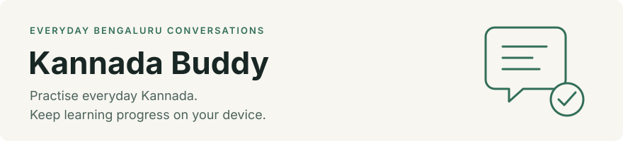
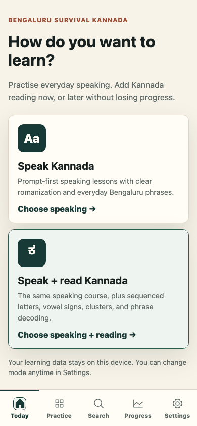

<picture>
  <source media="(prefers-color-scheme: dark)" srcset=".github/assets/banner-dark.svg">
  
</picture>



[Read the demo transcript](docs/demo-transcript.md) or [view the static result](.github/assets/demo-static.png). The demo uses isolated browser storage and no personal account.

[](LICENSE)
[](package.json)
[](docs/reference-workflows.md)

Kannada Buddy helps people practising everyday Bengaluru conversations retrieve a phrase before seeing its answer, then track their next review on the same device. It provides speaking practice, an optional Kannada reading pathway, and a searchable phrasebook with visible content-review status.

Release preparation is in progress. Content redistribution rights, private security reporting, and any unfinished checks remain visible in the [readiness record](docs/open-source-readiness.md).

## Contents

- [What it does](#what-it-does) describes the supported learning tasks and scope.
- [Quick start](#quick-start) runs the app and records a first practice attempt.
- [Choosing an entry point](#choosing-an-entry-point) maps tasks to routes and examples.
- [Usage](#usage) explains practice, backup, and content review.
- [Reference](#reference) describes persistence, inputs, outputs, and detailed workflows.
- [Before you rely on it](#before-you-rely-on-it) explains data-loss risks and learning limits.
- [Project](#project) lists validation, contribution, security, and licensing policies.

## What it does

- Practise speaking at `/`. Try an everyday prompt, reveal its answer, and self-report recall to schedule the next review.
- Add reading through `/settings`. Learn Kannada letters and signs while keeping speaking and reading progress separate.
- Find phrases at `/phrasebook` and reference drafts at `/library`. Review labels help distinguish core content, automated drafts, and published admin reviews.
- Prepare for a situation at `/travel`. Choose a scenario to find relevant phrases.
- Check progress at `/review` and download a backup at `/settings`. Progress stays in browser storage and can be restored manually.
- Review content at protected `/admin`. Export genuinely completed reviews for repository validation before shared publication.

The app does not score pronunciation automatically, synchronize devices, certify every translation as native-reviewed, or publish admin edits without a repository change.

## Quick start

Use Node.js 22.22.2 or newer in the 22 line, Node.js 24.15.0 or newer in the 24 line, or Node.js 26 or newer, with pnpm. No admin credentials or model account are needed for learning routes.

The repository is currently private. Cloning requires authorized GitHub access until it is published.

<!-- checked-snippet: quickstart -->
```sh
git clone https://github.com/mohitpatni28/Kannada-Buddy-PWA.git
cd Kannada-Buddy-PWA
pnpm install --frozen-lockfile
pnpm dev
```

Open `http://localhost:3000` in a fresh browser profile. Choose `Speak Kannada`, try the displayed prompt aloud, then choose `Reveal and compare` to see the romanized answer. Choose `Said it` to record independent recall, or choose the outcome that actually matches your attempt.

Open `/review` and reload the page. The practised concept remains in learning progress with a saved review schedule. This result records your own assessment, not a pronunciation score or a claim of retained mastery.

The [practice example](examples/learn-first-phrase/README.md) automates this same task with fresh browser storage and assertions. The demo above shows the same sequence.

## Choosing an entry point

| You have | Use | Example |
|---|---|---|
| A few minutes to practise | `/` and `/review` | [Record a speaking attempt](examples/learn-first-phrase/README.md) |
| Progress to preserve | `/settings` | [Retain and restore progress](examples/retain-progress/README.md) |
| A completed content review | `/admin` and the review validator | [Export and validate a synthetic review](examples/review-synthetic-export/README.md) |
| A real-world situation | `/travel` and `/phrasebook` | [Choose a scenario and search its phrases](examples/retain-progress/README.md) |
| Source material to inspect | `/library` and `/sources` | [Inspect reference drafts and source attribution](examples/retain-progress/README.md) |

## Usage

### Practise and review

Use the quickstart sequence to record an attempt. At `/settings`, choose speaking or speaking plus reading, a session length, and a reference-deck preference. These settings adjust subsequent sessions without erasing learning progress.

Regular AI reference drafts can enter the default reference deck. Caution drafts require an explicit setting, and held candidates stay out until genuinely reviewed and published. Check the displayed status before relying on a phrase.

### Back up and restore

At `/settings`, choose `Download backup` and keep the JSON file privately. To restore it, use `Choose a backup to restore`, inspect the preview, and choose `Restore backup`. The app reports `Backup restored on this browser` when the restore completes.

Restoring replaces the backed-up stores in that browser. Backups exclude admin edits and credentials, so export reviewed admin work separately before clearing site data.

### Review and publish content

Use `/admin` only after configuring private local credentials as described in the [admin reference](docs/reference-workflows.md#admin-access). `Approve for export` is a local decision, and an export must record only checks the reviewer actually performed.

Follow the [publication reference](docs/reference-workflows.md#publish-reviewed-phrases) to validate a genuine export and inspect the content diff. Applying an export updates `data/published-phrases.json` locally and does not push or deploy it.

The [examples index](examples/README.md) provides the complete reproducible examples. Synthetic export examples are test data and must never become genuine published approvals.

## Reference

| Contract | Behavior |
|---|---|
| Practice input and output | A self-reported speaking or reading outcome updates local scheduling and attempt history. |
| Persistence | Browser storage keeps progress, preferences, and admin overrides. There is no backend or device synchronization. |
| Backup | Settings exports supported learner stores to JSON. Restore validates the file before replacing those stores. |
| Review publication | Checked review JSON merges into a tracked artifact. Stale sources, invalid fields, and incomplete reviews are rejected. |
| Content boundaries | Raw imports, AI drafts, admin reviews, native review, and audio approval remain distinct. |
| Audio | Packaged clips take precedence. Available device speech is labeled as an unreviewed preview. |
| Offline | Production caching requires an initial online visit. Protected admin routes always use the network. |
| Errors | Storage, restore, and review validation failures report errors rather than supplying invented approvals. |

The [workflow reference](docs/reference-workflows.md) covers imports, enrichment, publication, audio generation, admin setup, retention rules, and deployment. It also records migration of compatible legacy phrase progress and the 500-entry limit on detailed recent history.

## Before you rely on it

Clearing site data deletes local progress, preferences, and admin edits. Download a learner backup and separately export reviewed admin work first. A learner backup cannot recover admin edits.

Automated text and device speech can be wrong. Admin review does not establish native-speaker or audio approval, and self-reported outcomes do not measure pronunciation. Verify wording with a qualified speaker before using uncertain content in consequential conversations.

Retained status requires independent recall on distinct scheduled days and a sufficient delayed recall gap. An initial success or same-session correction does not establish retention. Overdue reviews can remove retained status.

Installability, audio, and offline availability depend on browser support and successful initial caching. The service worker registers in production, so `pnpm dev` does not demonstrate offline operation. Hosted admin access requires HTTPS because HTTP Basic authentication relies on transport encryption.

## Project

The application is version `0.1.0` and is not an npm library. It uses Next.js App Router, React, TypeScript, and pnpm. No support response time or future release schedule is promised.

Run the complete checks from the repository root after installing dependencies. Chromium is needed for the browser suite, and the production build must precede it.

<!-- checked-snippet: validation -->
```sh
pnpm lint
pnpm test
pnpm content:validate
pnpm content:validate-all
pnpm build
pnpm exec tsc --noEmit
pnpm exec playwright install chromium
pnpm test:e2e
pnpm examples:check
pnpm docs:check
```

The suites cover pure logic, UI and storage integration, regression cases, and browser workflows. They do not establish linguistic correctness or content redistribution rights. The [readiness record](docs/open-source-readiness.md) distinguishes actual results, blocked checks, and hosted CI verification.

Follow [CONTRIBUTING.md](CONTRIBUTING.md) and the independent review requirements in [AGENTS.md](AGENTS.md). See [SECURITY.md](SECURITY.md) for reporting guidance and the pending private reporting channel. Do not put credentials, private backups, or exploit details in public issues.

Project code is [MIT licensed](LICENSE), copyright 2026 fakecoder28. Third-party code, content, fonts, model assets, and recordings keep their own terms and are not relicensed under MIT. The [workflow reference](docs/reference-workflows.md#license-and-attribution) and `/sources` describe existing attribution.

Independently created learning text is licensed under [CC BY-SA 4.0](CONTENT-LICENSE.md). Wikivoyage-derived material retains its source attribution and share-alike obligations, including the source-linked AI drafts. Packaged-audio rights and other release checks remain unresolved, so this preparation does not claim public-release readiness.
